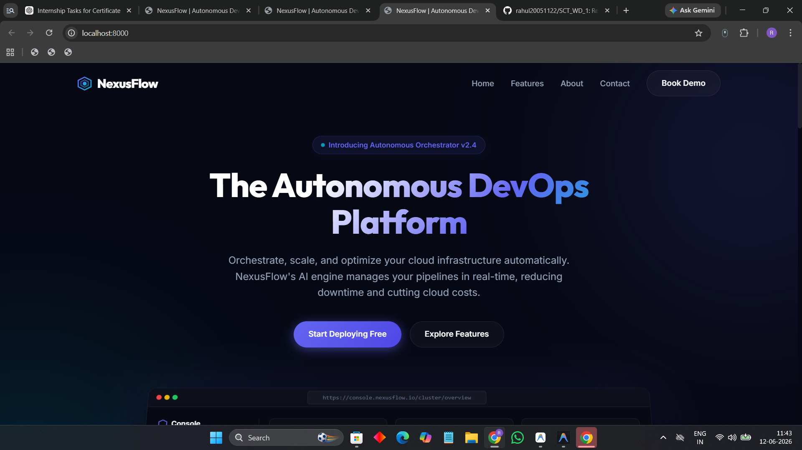
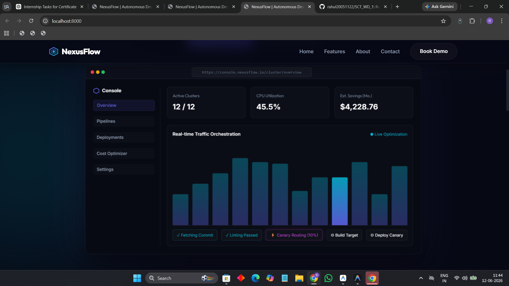
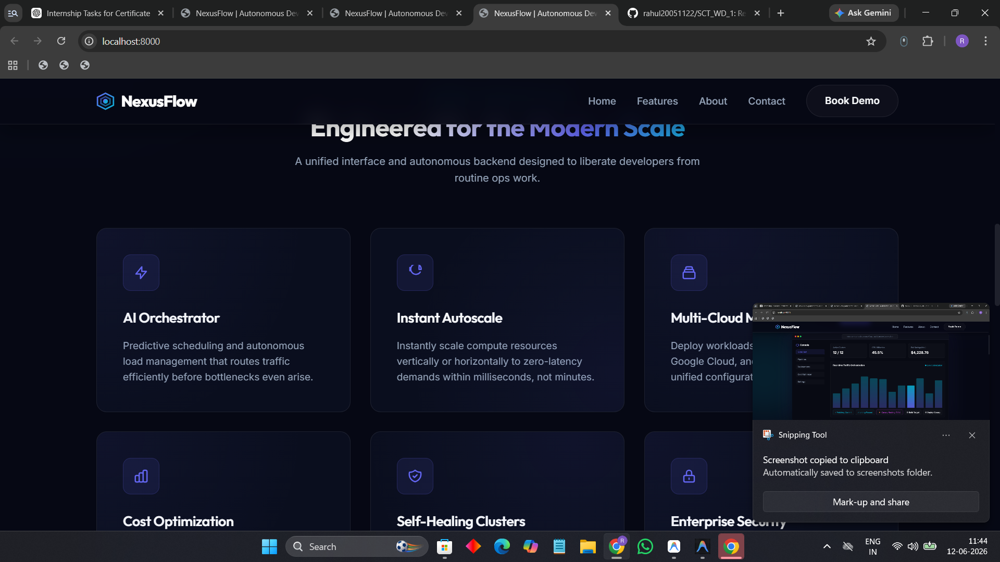

# SCT_WD_1
Responsive Landing Page
# 🌐 Responsive Landing Page

A modern and fully responsive landing page developed as **Task 1** of the **SkillCraft Technology Web Development Internship**.

## 🚀 Project Overview

This project demonstrates the creation of an interactive and visually appealing landing page using HTML, CSS, and JavaScript. The website features a fixed navigation menu, smooth scrolling effects, hover animations, and a responsive layout that adapts seamlessly across different screen sizes.

## ✨ Features

* Fixed Navigation Bar
* Interactive Hover Effects
* Scroll-Based Navigation Style Changes
* Fully Responsive Design
* Modern User Interface
* Smooth Scrolling Experience
* Cross-Browser Compatibility
* Mobile-Friendly Layout

## 🛠️ Technologies Used

* HTML5
* CSS3
* JavaScript

## 📂 Project Structure

```text
SCT_WD_1/
│
├── index.html
├── style.css
├── script.js
├── screenshots/
└── README.md
```

## 📸 Project Screenshots

### Desktop View



### Navigation Bar



### Features Section



### Mobile Responsive View


## 🎯 Objectives

The primary objective of this project is to develop a responsive landing page that provides an engaging user experience while implementing modern web development practices.

## 💡 Key Concepts Implemented

* Responsive Web Design
* CSS Flexbox and Grid
* DOM Manipulation
* Event Handling
* Navigation Menu Interactivity
* Scroll-Based Effects
* User Interface Design

## 📱 Responsive Design

The landing page is optimized for:

* Desktop Computers
* Laptops
* Tablets
* Mobile Devices

## 🔮 Future Enhancements

* Dark Mode
* Animation Libraries
* Contact Form Integration
* Backend Connectivity
* Theme Customization

## 📖 Learning Outcomes

Through this project, I gained hands-on experience in:

* Building responsive web layouts
* Creating interactive navigation systems
* Implementing modern CSS techniques
* Enhancing user experience through UI design
* Using JavaScript for dynamic webpage behavior

## 🙏 Acknowledgement

This project was completed as part of the **SkillCraft Technology Web Development Internship Program**.

⭐ If you found this project useful, feel free to star this repository.
